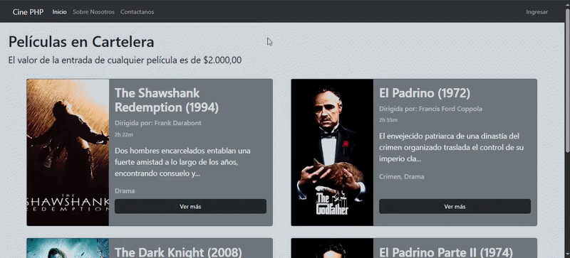

# Sistema Web CRUD de Cine — PHP & MySQL

Aplicación web desarrollada en PHP y MySQL para la gestión integral de un cine. Permite administrar el catálogo de películas y la base de datos de usuarios mediante una arquitectura modular basada en acciones y componentes reutilizables, aplicando operaciones completas de CRUD (Creación, Lectura, Actualización y Borrado) y un diseño moderno e intuitivo con Bootstrap.

---

## 📸 Vista Previa del Sistema
*Demostración del flujo de administración (inicio de sesión, modificación de registros y actualización en tiempo real):*

---

## 🔑 Credenciales de prueba

La base de datos de ejemplo incluye tres usuarios, uno por cada rol del sistema:

| Rol | Email | Contraseña |
|---|---|---|
| Administrador | `admin@admin.com` | `asd` |
| Premium | `premium@premium.com` | `asd` |
| Común | `comun@comun.com` | `asd` |

---

## 🏛️ Estructura del Proyecto

El código fuente está organizado por responsabilidades y componentes de interfaz:

- db/
  - cinephp.sql
- proyecto/
  - index.php — enrutador principal y plantilla base
  - acciones/ — procesamiento de formularios (9 archivos)
  - clases/ — modelos de dominio: `Conexion`, `Pelicula`, `Usuario`
  - componentes/ — fragmentos reutilizables: `navbar`, `footer`, `banner_premium`
  - css/ — `estilos.css`
  - utilidades/ — helpers de validación, constantes de rol y conexión
  - vistas/ — pantallas del sistema (14 archivos)
  - imagenes/ — recursos gráficos y pósters de películas

---

## 🚀 Arquitectura y Componentes Implementados

* **Capa de Datos y Conexión (clases/Conexion.php):** Gestión centralizada de la conexión a la base de datos MySQL mediante PDO o extensiones nativas de PHP.
* **Modelos de Dominio (clases/):** Pelicula.php encamina la lógica del catálogo y Usuario.php administra la autenticación y control de roles.
* **Controladores de Acción (acciones/):** Scripts independientes encargados de procesar peticiones de formularios para altas, bajas, modificaciones y control de sesiones.
* **Componentes Visuales y Estilos (componentes/ y css/):** Fragmentos reutilizables (navbar, footer, banner_premium) integrados con **Bootstrap** para lograr una interfaz responsiva, complementados con hojas de estilos personalizadas (`estilos.css`).

---

## 🛠️ Funcionalidades Principales

* 🎬 **Gestión de Películas:** Alta de nuevos títulos con soporte para carga de recursos gráficos (pósters), modificación de metadatos y eliminación de registros.
* 👥 **Administración de Usuarios:** Registro, inicio de sesión, modificación de perfiles y cambio de roles de usuario de forma dinámica.
* ✉️ **Interacción:** Procesamiento de formularios de contacto y maquetación fluida mediante clases utilitarias de Bootstrap.

---

## 💻 Requisitos y Configuración Local

* **Servidor Web:** Apache / Nginx (compatible con XAMPP, WampServer o Docker).
* **PHP:** Versión 7.4 o superior.
* **Base de Datos:** MySQL / MariaDB.
* **Frontend:** Bootstrap (cargado mediante CDN o archivos locales).

### Pasos de instalación:
1. Colocar la carpeta del proyecto en el directorio raíz del servidor local (ej. htdocs).
2. Importar el archivo SQL ubicado en db/cinephp.sql desde phpMyAdmin para crear la base de datos.
3. Configurar los parámetros de conexión en clases/Conexion.php.
4. Abrir el navegador e ingresar a la ruta correspondiente del proyecto.

---

> 🎓 Contexto académico: Proyecto desarrollado para la materia Programación Web II — Carrera de Analista de Sistemas.
